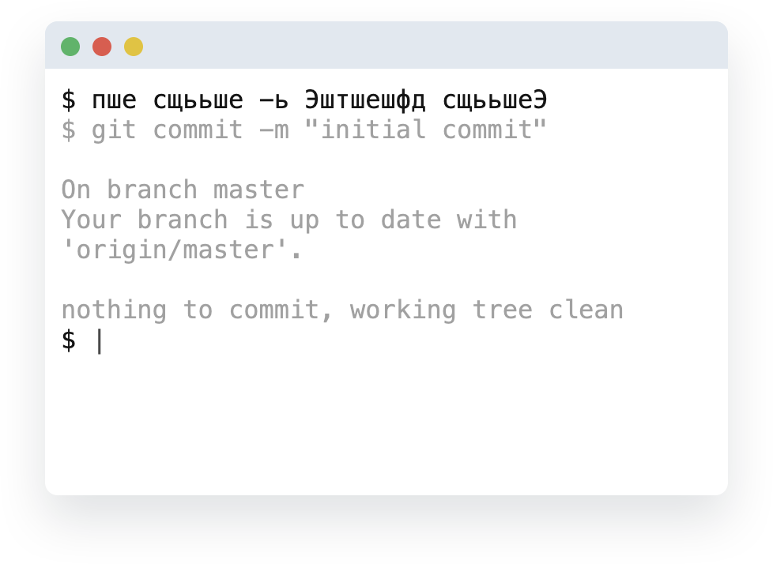

[npm-badge]: https://img.shields.io/npm/v/@danakt/pshe.svg
[npm-link]: https://npmjs.com/package/@danakt/pshe

# ПШЕ [![NPM][npm-badge]][npm-link]
Хватит это терпеть!

<div style="text-align:center">
  
</div>

## Установка

```
yarn global add @danakt/pshe
```
